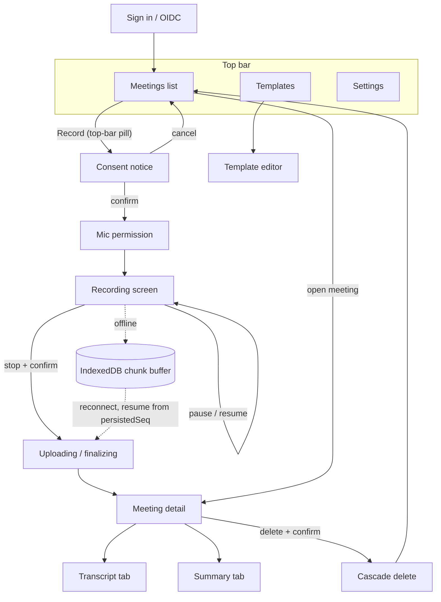

# V1 UI Structure — Screens & Navigation

Mobile-first PWA (phones are a primary case); every screen scales up to desktop. Layout: a single centered content column under one sticky top bar, at every width — there is no sidebar and no bottom tab bar.

> **Superseded section by section by the v2 redesign.** This file still describes the v1 visual
> language. Every section below carries a `v2:` marker naming the area that owns its rewrite. When
> that area's redesign lands, its PR rewrites those sections in place and drops their marker — so a
> section still carrying a marker is guidance that has not yet been re-decided, and a section
> without one is current. Nothing here is deleted ahead of the PR that replaces it: stale styling
> guidance is easier to spot than missing guidance. The behavioral rules in `STATES.md` are not
> superseded and apply to both versions.

## 1. Navigation model

One sticky top bar carries the whole model, at every width, on every screen the shell renders:

`Q mark · nav pill (Meetings | Templates) · spacer · settings icon · record pill`

- **Meetings** (default/home) — list of all meetings with status. A segment of the nav pill.
- **Templates** — summary template list + editor. The other segment.
- **Settings** — account, appearance, app info. An icon button at the far end, outside the pill:
  a place you visit, not a place you work.
- **Record** — the action the bar ends on, an espresso pill, never a destination in the nav.

While a recording session is live the record pill is replaced, in place, by the live pill: red with
a breathing dot, `REC` and the running timer; neutral and bordered with a pause glyph while the
session is held. It is one button and it leads back to the recording screen, which the user may
always leave — the session belongs to the app, not to that screen.

Auth (OIDC redirect) wraps everything; unauthenticated users only see the sign-in screen.

## 2. Screen inventory

### 2.1 Meetings list (`/meetings`)

> v2: superseded — rewritten by the **meetings list** redesign.
- Header: "Meetings" + search field (pill-shaped `Input` with `Search` icon; client-side title filter in V1, live as you type, clear button when non-empty; "no results" shows a calm empty note with a "Clear search" action — no illustration).
- List of `MeetingListItem`s, newest first: title, date, duration, `StatusBadge`, overflow menu (Open / Rename / Delete).
- Recovery card at top if an interrupted local session exists (STATES.md §2).
- Empty state (first run): honey icon tile (`Mic`, per COMPONENTS.md §12) + "Your first meeting awaits" + primary "Start recording" + ghost link "How Quorum works" opening the 3-step onboarding sheet (COMPONENTS.md §12). This is the app's front door — it should feel like an invitation, not a void.

### 2.2 Recording flow (`/record`)

> v2: superseded — rewritten by the **recording** redesign.
1. Tap Record → **Consent notice** (STATES.md §1).
2. Confirm → mic permission (browser prompt; denial shows an inline explainer with retry, not an error toast).
3. **Recording screen**: timer, level meter, `RecordingIndicator`, sync status, pause/resume, stop (with confirm popover), optional title field. Wake lock held.
4. Stop → brief finalizing state → navigate to the new meeting's detail (processing states take over).

### 2.3 Meeting detail (`/meetings/:id`)

> v2: superseded — rewritten by the **meeting detail** redesign.
- Header: title (inline-editable), date, duration, `StatusBadge`, overflow (Rename / Delete).
- **Tabs: Transcript | Summary** (shadcn `tabs`), each with independent processing/failed/ready states.
  - Transcript tab: `TranscriptView` with word timestamps; playback-synced highlighting; tap word → seek.
  - Summary tab: `SummaryView` (sections per template snapshot) + **Regenerate** action (in V1: creates a new summarize job with the current template; button shows the `RefreshCw` icon, flips the tab back into the processing state — stepper at "Summarizing") + copy actions.
- **Sticky bottom `AudioPlayer`** (available as soon as audio is finalized, independent of transcript state).

### 2.4 Templates (`/templates`)

> v2: superseded — rewritten by the **templates** redesign.
- List: system template (marked "System", read-only, "Duplicate" action) + user templates (`basedOn` system, per `shared/src/summary.ts`).
- **Template editor** (`/templates/:id`): name field; options (tone, length, output language as selects); section list — each section a card with title, instruction textarea, format select (prose/bullets/table), reorder (up/down), hide/remove; "Add section". Save = new template version (versioning surfaced quietly in meta text).
- Inherited sections show a subtle "From system template" tag; overriding converts them to an override entry (add/replace/hide semantics handled transparently).

### 2.5 Settings (`/settings`)

> v2: superseded — rewritten by the **settings** redesign.
- Account: signed-in identity, sign out.
- Appearance: theme (system / light / dark).
- Language: UI language (i18n).
- About: version, self-hosted instance info.
- (Retention rules, quotas: V2 — leave a placeholder group out entirely rather than shipping disabled controls.)

### 2.6 Auth (`/login`)

> v2: superseded — rewritten by the **landing and auth** redesign.
- Minimal: wordmark, one-line value prop ("Your meetings. Your infrastructure."), "Sign in" button → OIDC redirect (Authorization Code + PKCE). Error banner on failed callback.

## 3. Flow diagram

## 4. Responsive rules

- The same top bar at every width; nothing is anchored to the bottom edge, so no screen needs an
  exception from the shell.
- The content column is capped at `--shell-width` (1060px, exposed as `max-w-shell`). The top bar's
  inner row and the main column share that cap and the same gutter, so the two line up at every
  width; routes inherit it from the shell and never set their own outer width.
- `< 760px` (the shell breakpoint): the bar sheds words and keeps every control — the wordmark next
  to the Q mark and the label on the record pill drop, leaving Q and the microphone. Sheets instead
  of dialogs for forms.
- `≥ 760px`: wordmark and record label are shown; dialogs.
- Recording screen is always full-screen and distraction-free on all sizes — the breathing indicator is the only ambient motion.
- PWA: installable, standalone display; theme-color follows `background` token per color scheme; recording screen prevents display sleep via Wake Lock API.

## 5. Route summary

| Route | Screen |
|---|---|
| `/login` | Auth |
| `/meetings` | Meeting list (home) |
| `/record` | Recording flow |
| `/meetings/:id` | Meeting detail (`?tab=transcript\|summary`) |
| `/templates` | Template list |
| `/templates/:id` | Template editor |
| `/settings` | Settings |
